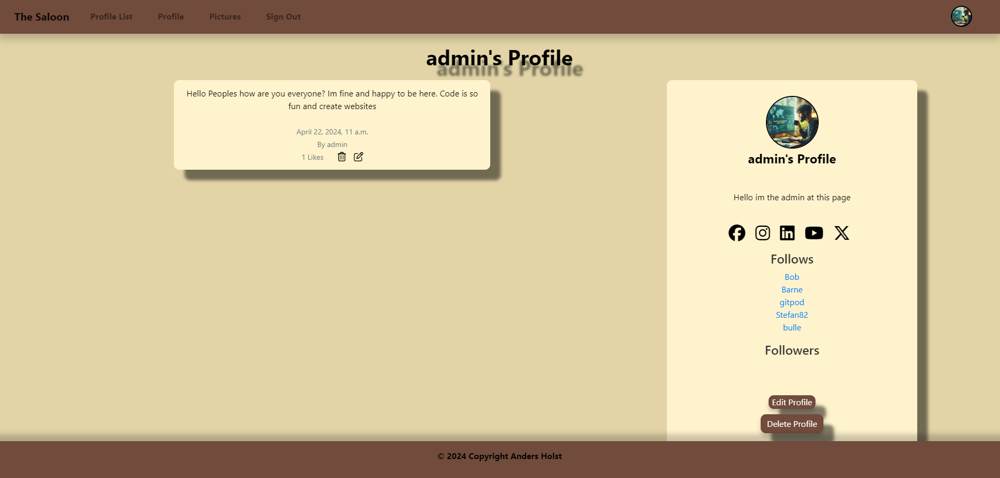

<p align="center">
  
</p>

# Welcome to The Saloon

This project is a Django-based social media platform where users can create profiles, post shouts, upload images, and interact with each other. It includes features like user registration, profile management, shouting, and image uploading.

# Table of Contents

- [Welcome to The Saloon](#welcome-to-the-saloon)
- [Features](#features)
- [User Stories](#user-stories)
- [UX Design](#ux-design)
- [Flowchart](#flowchart)
- [Setup](#setup)
  - [Prerequisites](#prerequisites)
  - [Installation](#installation)
- [Usage](#usage)
- [URLs](#urls)
- [Forms Overview](#forms-overview)
  - [ProfilePicForm](#profilepicform)
  - [ShoutForm](#shoutform)
  - [SignUpForm](#signupform)
  - [UploadImageForm](#uploadimageform)
- [Additional Notes](#additional-notes)
- [Models Overview](#models-overview)
  - [Shout Model](#shout-model)
  - [Profile Model](#profile-model)
  - [UploadedImage Model](#uploadedimage-model)
- [Signals](#signals)
- [Usage](#usage)
- [Django Project URL Configuration](#django-project-url-configuration)
- [Django Application Testing Documentation](#django-application-testing-documentation)
- [Contributing](#contributing)
- [Authors and Acknowledgments](#authors-and-acknowledgments)
- [License](#license)


## Features

- User Authentication: Users can register, log in, and log out of the application.
- Posting Shouts: Users can post messages known as "shouts" which are displayed on the homepage.
- Following Profiles: Users can follow other profiles and see their shouts.
- Profile Management: Users can view their own profile and the profiles of others.
- Image Upload: Users can upload images which are associated with their profile.
- Like and Delete Shouts: Users can like or delete their own shouts.
- Edit and Delete Images: Users can edit or delete their uploaded images.

### Existing Features

- __Navigation Bar__

    - The full responsive navigation bar is available on all pages.
    Upon entering the page, users can press the logo,
    "The Saloon," which then directs them to the start page.
    On the start page, there is a profile list visible only to logged-in users. Additionally, there are registration and login buttons for users who are not yet logged in.

    - Once logged in, users gain access to additional navigation options, including 
    buttons for the profile list, profile, gallery, and log-out. The navigation bar also features a profile picture on the right side, which links to the user's profile. This design is consistent across all pages to facilitate easy navigation, regardless of the device being used.

    - This approach ensures that users can smoothly navigate from page to page
    without needing to rely on the browser's back button, enhancing the overall user experience across all devices.


Here you can see the navigation bar when you log in or register.

    

Here you can see the navigation bar when you are logged in.


- Under the navigation bar, a text appears when you:

- Login


- Logout


- Register


- Posted shout


- Edit shout


- Update profile


- __The landing page image__

    - On the Landing page, the user will be able to log in or sign up via navbar.


 
- __Registration page__

  - Here you can enter username, first name, last name, e-mail, password and 
   then confirm with the same password.


- __Shout page__

  - Here the user can read other people's shouts and also write their own shouts. The user can also like or unlike shouts.


- __Profile page__

  - On your profile page, you can see your profile bio, which includes a profile picture where you can write a brief bio about yourself. You can also add links to your social media, view your followers and the profiles you follow, and use the follow/unfollow button. Additionally, there's an edit profile button and a delete button.



- __Gallery__

  - This page allows the user to upload images.


- __Profile list__

  - This page shows which users are registered on the page with profile picture and last updated. 


- __Other pages__

  - Then there is the edit page that you access via profile.


  - A page where you get to edit Shouts via the profile if you press edit.


- __Social media links__


When the user enters a link in one of the fields, an icon of it appears in the profile, which then sends the user to that page and when hovering over it changes color.


### Some other features ideas for the page

- The user should be able to like or dislike profiles.
- All users should be able to upload images for all to see.
- The user could write messages to other users.

## User Stories

- As a new user, I want to sign up for an account so that I can start using the platform.
- As a user, I want to create and update my profile so that I can share my information with others.
- As a user, I want to post shouts so that I can share my thoughts and ideas.
- As a user, I want to like shouts so that I can show my support.
- As a user, I want to upload images so that I can share my moments with others.
- As a user, I want to follow others so that I can see their shouts and images in my feed.

## UX Design

The user interface is designed to be simple and intuitive. Users can easily navigate through the platform to create profiles, post shouts, upload images, and interact with others. The design is responsive, ensuring a good user experience on both desktop and mobile devices.

## Flowchart

1. Start: The user accesses the website.

2. Navbar: The user sees the navbar, which changes based on authentication status.

    * Authenticated User: Sees options to navigate to their profile, upload images, view the profile list, and sign out.

    * Unauthenticated User: Sees options to log in or sign up.

3. Home Page: Displays a list of shouts (messages) and a form to submit a new shout.

    * Authenticated User: Can see their own shouts and like others' shouts.

    * Unauthenticated User: Cannot interact with shouts.

4. Login Page: Allows users to enter their credentials to log in.

5. Register Page: Allows unauthenticated users to register.

6. Profile List Page: Shows a list of profiles, allowing authenticated users to view details.

7. Profile Page: Displays detailed information about a user's profile, including shouts, likes, and social media links.

    * Authenticated User: Can edit their profile and delete their shouts.

    * Unauthenticated User: Can view profiles but cannot interact with them.

8. Edit Shout Page: Allows authenticated users to edit their shouts.

9. Footer: Contains copyright information.

### Detailed Steps

1. User Accesses Website: The user lands on the home page ``(home.html)``, which is extended from base.html.

2. Navbar Interaction: Depending on whether the user is authenticated, the navbar ``(navbar.html)`` displays different options.

    * Authenticated User: Sees options to navigate to their profile, upload images, view the profile list, and sign out.

    * Unauthenticated User: Sees options to log in or sign up.

3. Home Page Interaction: The home page ``(home.html)`` displays a list of shouts and a form to submit a new shout.

    * Authenticated User: Can see their own shouts and like others' shouts.

    * Unauthenticated User: Cannot interact with shouts.

4. Login Process: If the user is not authenticated, they are redirected to the login page ``(login.html)``.

5. Registration Process: If the user is not registered, they can register on the register page ``(register.html)``.

6. Profile List Interaction: Authenticated users can view the profile list ``(profile_list.html)``.

7. Profile Interaction: Users can view detailed profiles ``(profile.html)``, edit their own profile ``(update_user.html)``, and delete their shouts.

8. Edit Shout Process: Authenticated users can edit their shouts on the edit shout page ``(edit_shout.html)``.

9 .Footer Display: The footer ``(footer.html)`` is displayed on every page, containing copyright information.


## Setup

### Prerequisites

- Python 3.x
- Django 3.x
- PostgreSQL (or any other supported database)

### Installation

1. Clone the repository: [git clone](https://github.com/AndersH82/thesaloon.git)
2. Navigate to the project directory: `cd <thesaloon>`
3. Install dependencies: `pip install -r requirements.txt`
4. Set up the database: `python manage.py migrate`
5. Run the server: `python manage.py runserver`

## Forking

1. Navigate to the Repository: Go to the GitHub page of the repository you want to fork.

2. Fork the Repository: Click on the "Fork" button at the top right of the page. This action creates a copy of the repository under your GitHub account.

3. Customize Your Fork (Optional): After forking, you can customize your fork by changing its name, adding a description, or selecting which branches to copy. By default, all branches are copied, but you can choose to copy only the default branch if you're contributing to open-source projects.

4. Clone Your Fork: Clone the forked repository to your local machine to start making changes. Use the command git clone <https://github.com/AndersH82/thesaloon.git> in your terminal.

5. Make Changes: Edit the files in your local copy of the repository as needed.

6. Commit and Push Changes: Once you've made your changes, commit them using ``git commit -m "<your message>"`` and push them to your forked repository on GitHub with git push origin main (assuming you're working on the main branch).

7. Create a Pull Request: Navigate to your forked repository on GitHub and click on "New pull request". Compare your changes with the original repository and submit the pull request.

8. Review and Merge: The maintainers of the original repository will review your pull request. If everything looks good, they will merge your changes into the original repository.

## Usage

After setting up the project, you can access the following endpoints:

- Home Page: Displays all shouts and allows users to post new shouts.
- Profile List: Shows a list of all profiles excluding the current user's - profile.
- Profile Detail: Displays a specific user's profile and allows following/unfollowing actions.
- Login: Allows users to log in to their accounts.
- Logout: Logs out the currently logged-in user.
- Register: Allows new users to register.
- Update User: Allows users to update their profile information.
- Like/Unlike Shout: Allows users to like or unlike shouts.
- Delete Shout: Allows users to delete their own shouts.
- Edit Shout: Allows users to edit their own shouts.
- Upload Image: Allows users to upload images to their profile.
- Delete Image: Allows users to delete images from their profile.

## URLS

- `/`: Login page.
- `/home/`: Home page, requires login.
- `/profile_list/`: List of profiles.
- `/profile/<int:pk>`: Individual user profile.
- `/login/`: Login page.
- `/logout`: Logout functionality.
- `/register`: Registration page.
- `/update_user/`: Update user profile.
- `/shout_like/<int:pk>`: Like a shout.
- `/delete_shout/<int:pk>`: Delete a shout.
- `/edit_shout/<int:pk>`: Edit a shout.
- `/upload/`: Upload an image.
- `/delete_image/<int:pk>`: Delete an image.
- `/delete-profile/`: Delete a user profile.

## Forms Overview

This README provides an overview of the forms used in our Django application, including the `ProfilePicForm`, `ShoutForm`, `SignUpForm`, and `UploadImageForm`. Each form is designed to handle specific functionalities within the application, such as profile picture uploads, shouts, user sign-ups, and image uploads.

## ProfilePicForm

The `ProfilePicForm` is a `ModelForm` that allows users to upload a profile picture and fill out their profile information, including a bio, links to social media profiles, and other personal details.

### Fields

- `profile_image`: An image field for uploading the profile picture.
- `profile_bio`: A character field for entering the user's profile bio.
- `facebook_link`, `instagram_link`, `linkedin_link`, `youtube_link`, `x_link`: Character fields for entering various social media links.

### Usage

To use `ProfilePicForm`, instantiate it in your view and pass it to your template. Ensure to include `` in your form to protect against cross-site request forgery attacks.


## ShoutForm

The `ShoutForm` is a `ModelForm` for creating shouts. It includes a textarea for the shout content.

### Fields

- `body`: A textarea for the shout content.

### Usage

Similar to `ProfilePicForm`, instantiate `ShoutForm` in your view and pass it to your template. Include `` for CSRF protection.


## SignUpForm

The `SignUpForm` extends `UserCreationForm` to include additional fields for user sign-up, such as email, first name, and last name.

### Fields

- `email`: An email field for entering the user's email address.
- `first_name`: A character field for entering the user's first name.
- `last_name`: A character field for entering the user's last name.

### Usage

Instantiate `SignUpForm` in your view and pass it to your template. Include `` for CSRF protection.


## UploadImageForm

The `UploadImageForm` is a `ModelForm` for uploading images.

### Fields

- `image`: An image field for uploading the image.

### Usage

Instantiate `UploadImageForm` in your view and pass it to your template. Include `` for CSRF protection.

## Additional Notes

- Ensure to handle form submissions in your views, validating the form data and saving it to the database as needed.
- Customize the appearance of forms in your templates using Django's template language, as shown in the examples above.
- For more detailed information on working with forms in Django, refer to the [official Django documentation](https://docs.djangoproject.com/en/5.0/topics/forms/).

## Models Overview

### Shout Model

- Represents a shout or message posted by a user.
- Each shout is associated with a user and can have multiple likes from other users.
- Includes fields for the user who made the shout, the content of the shout, the timestamp of creation, and the number of likes.
- Provides a method `number_of_likes` to count the number of likes a shout has received.

### Profile Model

- Extends the Django User model to add additional user-related information.
- Includes fields for following other users, last modified date, profile image, bio, and links to social media profiles.
- Provides a class method `get_or_create_profile` to retrieve or create a profile for a given username.
- Automatically creates a profile for a new user upon registration using a Django signal.

### UploadedImage Model

- Represents images uploaded by users.
- Each image is associated with a user and includes fields for the image file and the timestamp of upload.

## Signals

- A `post_save` signal is used to automatically create a profile for a new user upon registration. This ensures that every user has a corresponding profile.
- The signal handler `create_profile` sets up the initial state of the profile, including having the user follow themselves.

## Usage

- To use these models and signals, ensure they are imported into your Django application.
- The `Profile` model extends the Django User model, so it should be integrated with your authentication system.
- The `Shout` and `UploadedImage` models can be used to store and display user-generated content.

# Django Project URL Configuration

- This README provides an overview of the URL configuration for a Django project, specifically focusing on the inclusion of static and media files during development.

## Overview
- The URL configuration is a critical component of any Django project, defining how incoming HTTP requests are routed to the appropriate view functions. This document outlines the URL configuration for a Django project named the_saloon, including the handling of static and media files.

## Code Snippet
- The following code snippet is extracted from the project's urls.py file:

```
from django.contrib import admin
from django.urls import path, include
from django.conf import settings
from django.conf.urls.static import static

urlpatterns = [
    path('admin/', admin.site.urls),
    path('', include('the_saloon.urls')),
] + static(settings.MEDIA_URL, document_root=settings.MEDIA_ROOT)

if settings.DEBUG:
    urlpatterns += static(
        settings.MEDIA_URL, document_root=settings.MEDIA_ROOT)

```

## Key Components
- Admin URLs: The admin/ path is included to enable access to the Django admin interface.
- Application URLs: The the_saloon.urls path is included to route requests to the application's views.
- Static and Media Files: During development (DEBUG = True), the project serves static and media files. This is configured using static(settings.MEDIA_URL, document_root=settings.MEDIA_ROOT).

## Settings Configuration
- For the above URL configuration to work correctly, certain settings in settings.py must be properly configured:

- MEDIA_URL and MEDIA_ROOT: These settings define the URL and filesystem location where uploaded media files are stored. Example configuration:

```
MEDIA_URL = '/media/'
MEDIA_ROOT = os.path.join(BASE_DIR, 'media')
```
- STATIC_URL and STATIC_ROOT: These settings define the URL and filesystem location for static files (CSS, JavaScript, images). Example configuration:
```
STATIC_URL = '/static/'
STATIC_ROOT = os.path.join(BASE_DIR, 'static')
```
- DEBUG: This setting must be True during development to serve static and media files. It should be set to False in production environments.

# Django Application Testing Documentation

This document outlines the necessary information extracted from the provided code, focusing on Django application testing practices, specifically for forms, models, and views.

## Overview

Django provides a robust testing framework that allows developers to write unit tests for their applications. This framework is built on top of Python's `unittest` module and offers additional functionalities tailored for Django applications. The primary goal of these tests is to ensure that the application behaves as expected under various conditions, thereby improving code quality and reliability.

## Testing Forms

### ShoutForm

- **Validation with Valid Data**: Tests whether the form validates correctly with valid data.
- **Validation with Empty Body**: Ensures the form is invalid when the body field is empty and checks the error message.

### ProfilePicForm

- **Validation with Empty Data**: Verifies that the form is valid even when submitted with no data.
- **Rendering**: Checks if the form renders correctly, including the presence of specific input fields.

### SignUpForm

- **Field Attributes**: Tests the attributes of the form fields, such as class and placeholder.
- **Validation**: Validates the form with invalid data, specifically checking the email field.
- **Initialization**: Ensures that the form's initialization sets the correct attributes for the fields.

### UploadImageForm

- **Validation with Invalid Data**: Tests the form's validation behavior with invalid data, ensuring it correctly identifies required fields.

## Testing Models

### Shout Model

- **Number of Likes**: Tests the `number_of_likes` method, initially expecting zero likes.
- **Likes Method**: Verifies that the `number_of_likes` method correctly increments when a user likes a shout.

### Profile Model

- **Profile Creation**: Tests the creation of a profile for a user.
- **Profile Modification**: Checks if a profile can be modified and saved correctly.
- **Get or Create Profile**: Ensures that the `get_or_create_profile` method works as expected.

### Unfixed Bugs

- Found the error at the last second before submitting the project 
    - You must fill in the entire form and add a picture, otherwise you will not progress.
    - Link label, text when uploading image and the button are not styled with css.
    
### Fixed Bugs

- Now I've got the edit profile form in order. Have centered the entire form and the text. Can also delete an image when editing.

- I have fixed it so that you don't have to fill in the entire form to save an update. What you have to do now is that the user has to change their name and enter a password.

## Typography
I've integrated [Google Fonts](https://fonts.google.com/) to find a typeface that compliments the website's aesthetic. For the main text, I've chosen Roboto due to its optimization for readability on screens across a wide variety of devices and reading environments.

```
<link href="https://fonts.googleapis.com/css2?family=Roboto:wght@400;700&display=swap" rel="stylesheet">
```
```
body {
  font-family: 'Roboto', sans-serif;
}
```
## Languages Used


## Color Scheme

The base colors          |  Color for social media
:-------------------------:|:-------------------------:
  |  

The base colors

- Background Color: #E2D4A6
- Text Color: #000000
- Button Background: #714B3C
- Hover Button Background: #5E372E
- Alert Background: #FFF3CD

Color for social media

- Facbook link: #1877F2
- Instagram link: #833AB4
- Linkdin link: #0077B5
- Youtube link: #FF0000
- X link: #000000

## Wireframe

- Here is a framework of what the page would look like when I started planning for this website.

Home page          |  Gallery page
:-------------------------:|:-------------------------:
  |  

Profile page          |  Profile list page
:-------------------------:|:-------------------------:
  |  

Login page          |  Registration page
:-------------------------:|:-------------------------:
  |  

## Testing Views

### Login User View

- **Login Functionality**: Tests the login functionality by simulating a POST request to the login view and verifying the redirection.

### Home URL

- **Home URL Existence**: Checks if the home URL exists at the desired location.

### Home View

- **View with Login**: Tests the home view when a user is logged in, ensuring the correct response status code.

### Profile List View

- **Profile List View Setup**: Sets up a client and user for testing the profile list view.

### Lighthouse Testing

Update profile page          |  Gallery page
:-------------------------:|:-------------------------:
  |  

Home page          |  Login page
:-------------------------:|:-------------------------:
  |  

Profile page          |  Profile list page
:-------------------------:|:-------------------------:
  |  

Registration page          |  Edit shout page
:-------------------------:|:-------------------------:
  |  

### Validator Testing 

- HTML
  - __W3C Validation__

https://validator.w3.org/nu/?doc=https%3A%2F%2Fthesaloon-08255dd425ce.herokuapp.com%2F

    - The page receives 51 Info notes because it contains linebreaks in the html code. 
- CSS
  - __W3C Validation__

 https://jigsaw.w3.org/css-validator/validator?uri=https%3A%2F%2Fthesaloon-08255dd425ce.herokuapp.com%2F&profile=css3svg&usermedium=all&warning=1&vextwarning=&lang=sv

    - It passed the test but received 707 warnings that the website contains Bootstrap.

## Conclusion

This documentation provides a comprehensive overview of the testing strategies employed in the provided Django application code. By leveraging Django's testing framework, developers can ensure that their applications are robust, reliable, and adhere to best practices.

## Deployment

To deploy your website to Heroku, follow these steps:

1. Select the Website to Deploy: On the Heroku home page, choose the website you wish to deploy.

2. Go to the Link: Navigate to the provided link for the website you selected. For example, the link for the Saloon project is https://thesaloon-08255dd425ce.herokuapp.com/.

3. Find the Push Button: At the top of the page, locate the push button.

4. Choose the Branch: Decide which branch of your repository you want to deploy from. This could be the main branch or any other branch depending on your project's structure.

5. Press the Deploy Button: Finally, click the deploy button at the bottom of the page to initiate the deployment process.

This process allows you to deploy your website to Heroku directly from the website's home page, making it easy to manage and deploy your projects without needing to use the command line or Heroku CLI.

For deploying to GitHub Pages:

1. Navigate to the GitHub Repository: Go to the repository settings by clicking on the "Settings" tab.

2. Select the Source Branch: From the source section drop-down menu, select the branch you want to deploy. Typically, this would be the ``master`` or ``main`` branch.

3. Automatic Deployment: Once the master branch has been selected, the page will be automatically refreshed with a detailed ribbon display to indicate the successful deployment. Your site will be accessible at a URL like ``https://<username>.github.io/<repository-name>/``.

For the Saloon project, the GitHub repository is located at https://github.com/AndersH82/thesaloon.

## Contributing

- Contributions are welcome. Please feel free to submit a pull request or open an issue.

## Authors and Acknowledgments
- Author: Your Name
- Acknowledgments: Thanks to everyone who contributed to this project.

## Credits 

 - Default image - flaticon.com
 - Code search - Phind
 - Toutorials - youtube
 - Codemy - youtube
 - Bootstrap
 - W3 school
 - Google
 - Brandcolorcode - links
 - Fontawesome
 - Google fonts
 - My mentor on CI - Rory
 - Coolors.co for colors to the page
 - Wireframe
 - Github
 - Heroku
 - Gitpod
 - Django

## Other Notes

- Argil: I am a beginner at argil, and this is my first time. I'm looking forward to becoming better at argil in the future.

- Readme: I'm pretty happy with my README, but I'm confident that I can improve my work with future assignments.